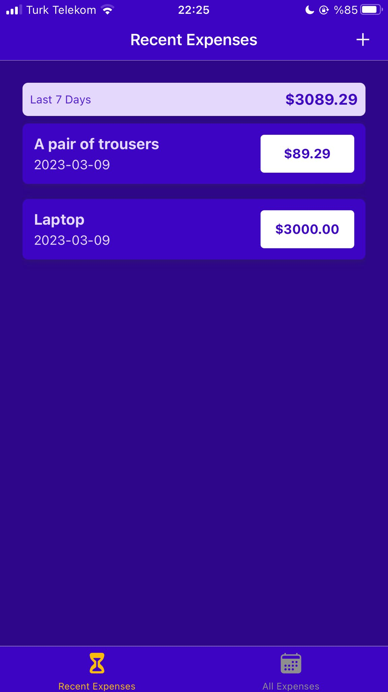
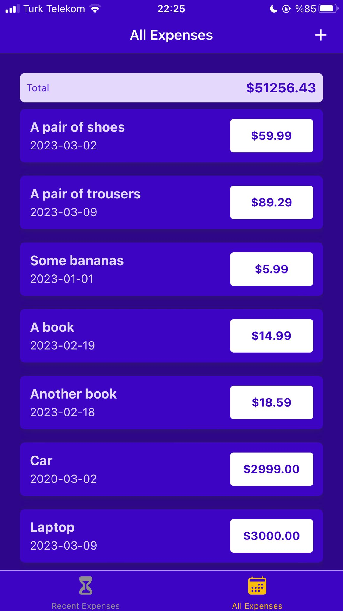

# goals-app

Example app to learn React Native! 

The user can add new goal or delete a goal.

To run this app you need to expo. You might want to check [Expo Documentation](https://docs.expo.dev/get-started/installation/).

After installation of expo, you should change directory to src folder. And then, basically run following command, and enjoy!

```bash
npm run start
```

[](android1.png)
[](android2.png)
[](android3.png)

[](ios1.jpeg)
[](ios2.jpeg)
[](ios3.jpeg)